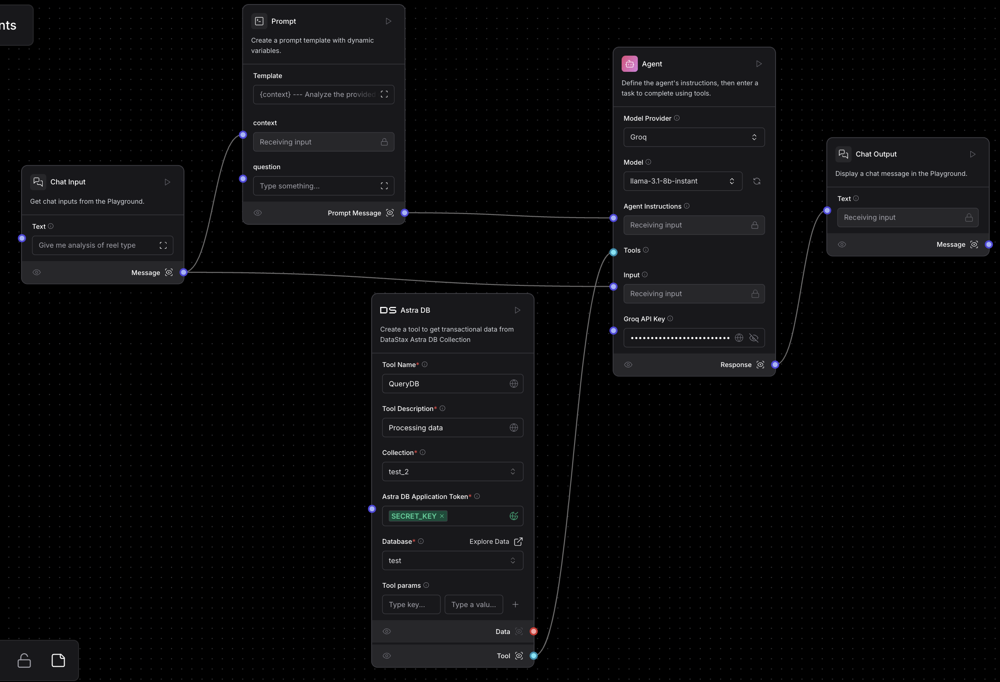

# Social Media Insights and Analysis: HackIt

This project is designed to generate insights and analyze social media data, focusing on metrics such as likes, comments, and shares across different types of posts. It helps identify trends and patterns to improve engagement strategies.

Check working website : [Hackit](https://hackit-thunderbolt.vercel.app)
---

## Features

- **Data Aggregation**: Collects data about posts, including likes, comments, and shares.
- **Post Type Analysis**: Analyzes the performance of different types of posts (e.g., static Images, reels, carousels, stories).
- **Engagement Metrics**: Calculates engagement rates and identifies top-performing content.
- **Actionable Insights**: Provides recommendations based on the analysis to improve social media strategies.

# <h1 align=center>Working of project</h1>
- This project is mainly divided in frontend and backend. 
## Frontend

The frontend application is built with **React** and leverages **Redux** for state management. The design incorporates **Tailwind CSS** for styling and includes features like:
- A sidebar to manage multiple chat sessions.
- A responsive chat interface for interacting with the chatbot.
- Markdown-to-HTML conversion for rendering messages.
- A fallback mode with default content when chat mode is disabled.

Detailed documentation for the frontend can be found inside the [frontend directory](./frontend/)

> [Detailed frontend documentation](./frontend/README.md)

## Backend

This backend API acts as a bridge between the client application and Langflow. It facilitates the processing of user prompts, communicates with Langflow, and returns structured responses to the client. The API is designed to handle errors gracefully and ensure seamless interaction.

Detailed documentation for the frontend can be found inside the [backend directory](./backend/)

> [Detailed backend documentation](./backend/README.md)
---

# LangFlow Flow Explanation

## Components

    
    <i align=center>Langlow flow</i>

### 1. **Chat Input**
- The starting point where the user inputs their query.
- Example input: `"Give me analysis of reel type"`

---

### 2. **Prompt Node**
- Generates a dynamic prompt based on the user input.

---

### 3. **Agent Node**
- Acts as the main processor of the flow.
- **Model Provider**: `Groq`
- **Model**: `llama-2-13b-instant`

---

### 4. **Astra DB Node**
- Connects to a DataStax Astra DB database.
- Retrieves data from the specified database collection and passes it back to the agent for analysis.

---

### 5. **Chat Output**
- Displays the final output to the user after the processing is complete.

---

## Example Workflow

1. The user enters a query (e.g., `"Give me analysis of reel type"`) in the **Chat Input** node.
2. The **Prompt Node** formulates a structured query or instruction based on the user’s input.
3. The **Agent Node**:
   - Handles the main task.
   - Interacts with external tools (like the Astra DB node) for data retrieval or computation.
4. The **Astra DB Node** fetches data from the specified database collection (`test_2` in `test`) and returns it to the agent.
5. The **Agent Node** processes the retrieved data and sends the result to the **Chat Output** node.
6. The **Chat Output** displays the result to the user.

---

## Summary

This flow demonstrates a LangFlow pipeline where:
- User input is processed through a dynamic prompt.
- External tools like Astra DB are used for database queries.
- The final output is displayed to the user after processing.

If you have additional questions or need further details, feel free to ask!

## License

This project is licensed under the MIT License. See the `LICENSE` file for details.

---

